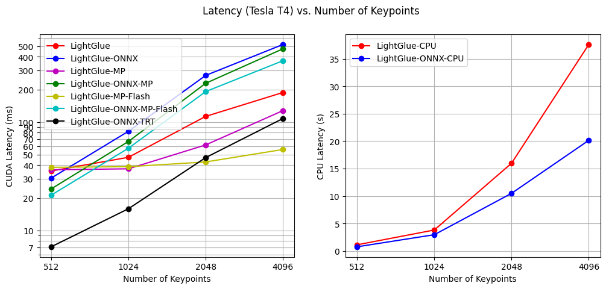

<div align="right"> English | <a href="https://github.com/fabio-sim/LightGlue-ONNX/blob/main/docs/README.zh.md">简体中文</a></div>

[](https://onnx.ai/)
[](https://developer.nvidia.com/tensorrt)
[](https://github.com/fabio-sim/LightGlue-ONNX/stargazers)
[](https://github.com/fabio-sim/LightGlue-ONNX/releases)

# LightGlue ONNX

Open Neural Network Exchange (ONNX) compatible implementation of [LightGlue: Local Feature Matching at Light Speed](https://github.com/cvg/LightGlue). The ONNX model format allows for interoperability across different platforms with support for multiple execution providers, and removes Python-specific dependencies such as PyTorch. Supports TensorRT and OpenVINO.

> ✨ ***What's New - 04 October 2023:*** Fused LightGlue ONNX Models with support for FlashAttention-2 via `onnxruntime>=1.16.0`, up to 80% faster inference on long sequence lengths (number of keypoints).

<p align="center"><a href="https://arxiv.org/abs/2306.13643"></a>

<details>
<summary>Changelog</summary>

- **02 November 2023**: Introduce TopK-trick to optimize out ArgMax for about 30% speedup.
- **27 October 2023**: LightGlue-ONNX added to [Kornia](https://kornia.readthedocs.io/en/latest/feature.html#kornia.feature.OnnxLightGlue)!
- **04 October 2023**: Multihead-attention fusion optimization.
- **19 July 2023**: Add support for TensorRT.
- **13 July 2023**: Add support for Flash Attention.
- **11 July 2023**: Add support for mixed precision.
- **04 July 2023**: Add inference time comparisons.
- **01 July 2023**: Add support for extractor `max_num_keypoints`.
- **30 June 2023**: Add support for DISK extractor.
- **28 June 2023**: Add end-to-end SuperPoint+LightGlue export & inference pipeline.
</details>

## 🔥 ONNX Export

Prior to exporting the ONNX models, please install the [export requirements](/requirements-export.txt).

To convert the DISK or SuperPoint and LightGlue models to ONNX, run [`export.py`](/export.py). We provide two types of ONNX exports: individual standalone models, and a combined end-to-end pipeline with the `--end2end` flag.

<details>
<summary>Export Example</summary>
<pre>
python export.py \
  --img_size 512 \
  --extractor_type superpoint \
  --extractor_path weights/superpoint.onnx \
  --lightglue_path weights/superpoint_lightglue.onnx \
  --dynamic
</pre>

- Exporting individually can be useful when intermediate outputs can be cached or precomputed. On the other hand, the end-to-end pipeline can be more convenient.
- Although dynamic axes have been specified, it is recommended to export your own ONNX model with the appropriate input image sizes of your use case.
</details>

### 🌠 ONNX Model Optimization 🎆

Although ONNXRuntime automatically provides [some optimizations](https://onnxruntime.ai/docs/performance/model-optimizations/graph-optimizations.html) out of the box, certain specialized operator fusions (multi-head attention fusion) have to be applied manually. Run [`optimize.py`](/optimize.py) to fuse the attention nodes in LightGlue's ONNX graph. On a device with sufficient compute capability, ONNXRuntime (minimum version `1.16.0`) will dispatch the operator to FlashAttention-2, reducing the inference time for larger numbers of keypoints.

<details>
<summary>Optimize Example</summary>
<pre>
python optimize.py --input weights/superpoint_lightglue.onnx
</pre>
</details>

If you would like to try out inference right away, you can download ONNX models that have already been exported [here](https://github.com/fabio-sim/LightGlue-ONNX/releases).

## ⚡ ONNX Inference

With ONNX models in hand, one can perform inference on Python using ONNX Runtime (see [requirements-onnx.txt](/requirements-onnx.txt)).

The LightGlue inference pipeline has been encapsulated into a runner class:

```python
from onnx_runner import LightGlueRunner, load_image, rgb_to_grayscale

image0, scales0 = load_image("assets/sacre_coeur1.jpg", resize=512)
image1, scales1 = load_image("assets/sacre_coeur2.jpg", resize=512)
image0 = rgb_to_grayscale(image0)  # only needed for SuperPoint
image1 = rgb_to_grayscale(image1)  # only needed for SuperPoint

# Create ONNXRuntime runner
runner = LightGlueRunner(
    extractor_path="weights/superpoint.onnx",
    lightglue_path="weights/superpoint_lightglue.onnx",
    providers=["CUDAExecutionProvider", "CPUExecutionProvider"],
    # TensorrtExecutionProvider, OpenVINOExecutionProvider
)

# Run inference
m_kpts0, m_kpts1 = runner.run(image0, image1, scales0, scales1)
```

Note that the output keypoints have already been rescaled back to the original image sizes.

Alternatively, you can also run [`infer.py`](/infer.py).

<details>
<summary>Inference Example</summary>
<pre>
python infer.py \
  --img_paths assets/DSC_0410.JPG assets/DSC_0411.JPG \
  --img_size 512 \
  --lightglue_path weights/superpoint_lightglue.onnx \
  --extractor_type superpoint \
  --extractor_path weights/superpoint.onnx \
  --viz
</pre>
</details>

See [OroChippw/LightGlue-OnnxRunner](https://github.com/OroChippw/LightGlue-OnnxRunner) for C++ inference.

## 🚀 TensorRT Support

TensorRT inference is partially supported via either *pure TensorRT* or the *TensorRT Execution Provider in ONNXRuntime*. Please follow the [official documentation](https://docs.nvidia.com/deeplearning/tensorrt/install-guide/index.html) to install TensorRT. The exported ONNX models (whether standalone or end-to-end) must undergo [shape inference](https://github.com/microsoft/onnxruntime/blob/main/onnxruntime/python/tools/symbolic_shape_infer.py) for compatibility with TensorRT.

For sample code using the TensorRT Python API, see [`trt_infer.py`](/trt_infer.py), which covers building the TensorRT engine and performing inference.

<details>
<summary>TensorRT via ONNXRuntime Example</summary>
<pre>
CUDA_MODULE_LOADING=LAZY && python infer.py \
  --img_paths assets/DSC_0410.JPG assets/DSC_0411.JPG \
  --lightglue_path weights/superpoint_lightglue_fused_fp16.onnx \
  --extractor_type superpoint \
  --extractor_path weights/superpoint.onnx \
  --trt \
  --viz
</pre>
</details>

The first run will take longer because TensorRT needs to initialise the `.engine` and `.profile` files. It is recommended to pass a static number of keypoints when using TensorRT.

## ⏱️ Inference Time Comparison

In general, the fused ORT models can match the speed of the adaptive PyTorch model despite being non-adaptive (going through all attention layers). The PyTorch model provides more consistent latencies across the board, while the fused ORT models become slower at higher keypoint numbers due to a bottleneck in the `NonZero` operator. On the other hand, the TensorRT Execution Provider can reach very low latencies, but it is also inconsistent and unpredictable. See [EVALUATION.md](/evaluation/EVALUATION.md) for technical details.

<p align="center"><a href="https://github.com/fabio-sim/LightGlue-ONNX/blob/main/evaluation/EVALUATION.md"></a>

## Caveats

As the ONNX Runtime has limited support for features like dynamic control flow, certain configurations of the models cannot be exported to ONNX easily. These caveats are outlined below.

### Feature Extraction

- Only batch size `1` is currently supported. This limitation stems from the fact that different images in the same batch can have varying numbers of keypoints, leading to non-uniform (a.k.a. *ragged*) tensors.

### LightGlue Keypoint Matching

- Since dynamic control flow has limited support in ONNX tracing, by extension, early stopping and adaptive point pruning (the `depth_confidence` and `width_confidence` parameters) are also difficult to export to ONNX.
- ~~Currently, the bottleneck for inference speed under ONNXRuntime is the `ArgMax` operator, which is placed on the CPU because it is unsupported by the CUDA Execution Provider.~~ Solved using TopK-trick. Now the bottleneck is the `NonZero` operator.

Additionally, the outputs of the ONNX models differ slightly from the original PyTorch models (by a small error on the magnitude of `1e-6` to `1e-5` for the scores/descriptors). Although the cause is still unclear, this could be due to differing implementations or modified dtypes.

Note that SuperPoint is under a non-commercial license.

## Possible Future Work

- **Support for dynamic control flow**: Investigating FX-graph/dynamo-based ONNX exporter instead of tracing/TorchScript-based ONNX exporter.

## Credits
If you use any ideas from the papers or code in this repo, please consider citing the authors of [LightGlue](https://arxiv.org/abs/2306.13643) and [SuperPoint](https://arxiv.org/abs/1712.07629) and [DISK](https://arxiv.org/abs/2006.13566). Lastly, if the ONNX versions helped you in any way, please also consider starring this repository.

```txt
@inproceedings{lindenberger23lightglue,
  author    = {Philipp Lindenberger and
               Paul-Edouard Sarlin and
               Marc Pollefeys},
  title     = {{LightGlue}: Local Feature Matching at Light Speed},
  booktitle = {ArXiv PrePrint},
  year      = {2023}
}
```

```txt
@article{DBLP:journals/corr/abs-1712-07629,
  author       = {Daniel DeTone and
                  Tomasz Malisiewicz and
                  Andrew Rabinovich},
  title        = {SuperPoint: Self-Supervised Interest Point Detection and Description},
  journal      = {CoRR},
  volume       = {abs/1712.07629},
  year         = {2017},
  url          = {http://arxiv.org/abs/1712.07629},
  eprinttype    = {arXiv},
  eprint       = {1712.07629},
  timestamp    = {Mon, 13 Aug 2018 16:47:29 +0200},
  biburl       = {https://dblp.org/rec/journals/corr/abs-1712-07629.bib},
  bibsource    = {dblp computer science bibliography, https://dblp.org}
}
```

```txt
@article{DBLP:journals/corr/abs-2006-13566,
  author       = {Michal J. Tyszkiewicz and
                  Pascal Fua and
                  Eduard Trulls},
  title        = {{DISK:} Learning local features with policy gradient},
  journal      = {CoRR},
  volume       = {abs/2006.13566},
  year         = {2020},
  url          = {https://arxiv.org/abs/2006.13566},
  eprinttype    = {arXiv},
  eprint       = {2006.13566},
  timestamp    = {Wed, 01 Jul 2020 15:21:23 +0200},
  biburl       = {https://dblp.org/rec/journals/corr/abs-2006-13566.bib},
  bibsource    = {dblp computer science bibliography, https://dblp.org}
}
```
